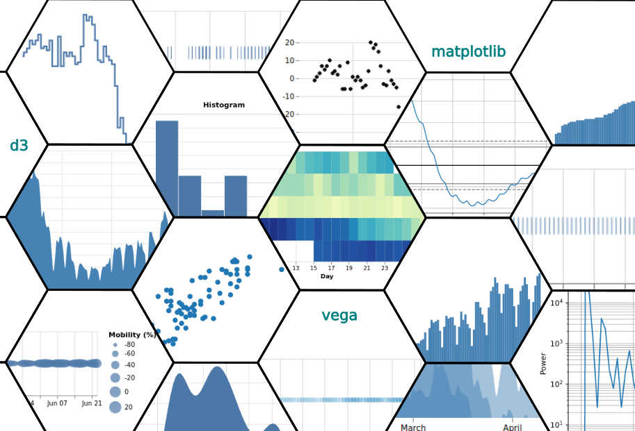

# Academy-Course-DAT31056

Timeseries Visualization with Python and Javascript ([21 Ways to Visualize a Timeseries](https://www.openriskmanagement.com/21_ways_to_visualize_a_timeseries/)) is a [deep dive course](https://www.openriskacademy.com/course/view.php?id=56) into visualization fundamentals.

## What this course is about (and what it isn't)

With the ever more widespread adoption of [Data Science tools](https://www.openriskmanual.org/wiki/Data_Science) (defined loosely as the intensive use of data in decision-making), there is strong interest in [Visualization](https://www.openriskmanual.org/wiki/Visualization) as an effective means for humans to understand information at various stages of the data *lifecycle*.

There is a large variety of open source data visualization [tools](https://www.openriskmanual.org/wiki/Open_Source_Visualization_Software) which can produce an ever more bewildering variety of [visualization types](https://www.openriskmanual.org/wiki/Visualization_Types):

So far, so good! Yet powerful tools used in the wrong way can have unintended consequences. Visualizations *are* powerful tools and thus come with their own unique set of challenges: 

* The message may be lost in visual "eye candy".
* The message may be incomplete.
* The message may be (intentionally or unintentionally) skewed or biased. 

In this course we want to do a "back-to-basics" tour, to learn how we can avoid these and related challenges.

Any visualization - without exception - must make opinionated choices about how to transform the underlying data to produce a visually perceivable artifact

By going deeper into the essence of data visualization we can hope to have *increased awareness* of the risks and opportunities that are intrinsic to the use of visualization to convey information. 

In turn, this task is best achieved by developing a *deeper understanding* of what we might call the visualization "production" process. There are two broad classes of *transformations* involved in producing a visualization:

### Mathematical Transformations

The first class concerns **Mathematical Transformations** that are applied in an abstract *data space*. This class of transforms is optional (but very common in practice). 

It concerns and involves various mathematical *maps*, filters and related operations. These start with the original data set and produce *intermediate data*. These intermediate results will typically have different "numerical appearance", but still represent the same underlying measurement.

### Visual Transformations

The second class of transformations involves one or more **Visual Maps**. 

These are also in a sense mathematical transformations, but are of a very special type: They link the aforementioned data space with the *visual space* we can perceive, and thus with the representation we eventually see.

In this course we aim to shed some light into this fascinating transformation process that is involved in any visualization no matter how simple. We aim to illustrate the relevant concepts using various distinct visualizations where:

* we use a rather simple dataset
* we keep the dataset intentionally *the same* throughout the exercise and
* we only vary the applied transforms (both the mathematical and visual transformation types)

This course is *not* an enumeration or classification of visualization types, nor a cookbook of how to visualize data using Python or Javascript! It is an excursion into the fundamentals of visualization, a partial deconstruction of the process to highlight some common techniques and associated issues.

After the reader completes this journey they will hopefully have a better intuition about how visualizations are put together, and thus be better able to use this fantastic tool in support of their data science objectives. 

In order to keep the task (and the study time) finite we will exclude from the discussion several important facets:

* the display and visualization of categorical or ordinal data. Our sample will be a typical *numerical timeseries* which is produced from a sequence of measurements
* working with more complex timeseries where the observations at each time point are not a single scalar but rather more structured *objects*. For example, even the addition of *error bars* to measurements produces a more structured and complicated timeseries
* we will not consider visualizations that involve multiple and *distinct* timeseries (so-called _mashups_ of separately measured phenomena)
* we will discuss some mathematical transformations usually performed in connection with visualization but there are many, many more such examples!
* we will ignore *pictograms*, as they concern a completely different visualization paradigm
* we will stick to the two-dimensional plane as this is already a rich enough canvas (thus ignoring 3D visualizations)
* we will ignore *animations and/or dynamic visualizations* (e.g., graphical elements such as tooltips that appear on hover of a mouse pointer). Such tools inject even more complex structures and transformations into the visualization process.

The size of the above "ignore list" shows how vast the space of all possible visualizations! Nevertheless, the principles we will cover have broader applicability.

### Further Reading

* [Open Risk Academy](https://www.openriskacademy.com/course/view.php?id=56).
* The inspiration for this course comes from *Leland Wilkinson, The Grammar of Graphics*.